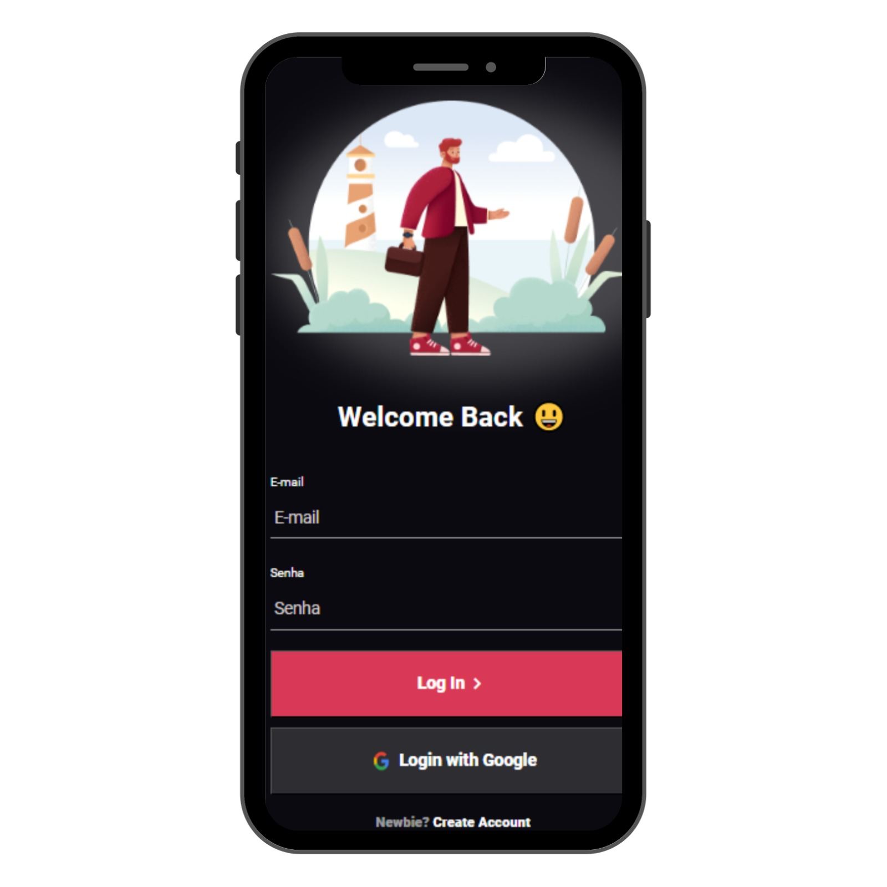
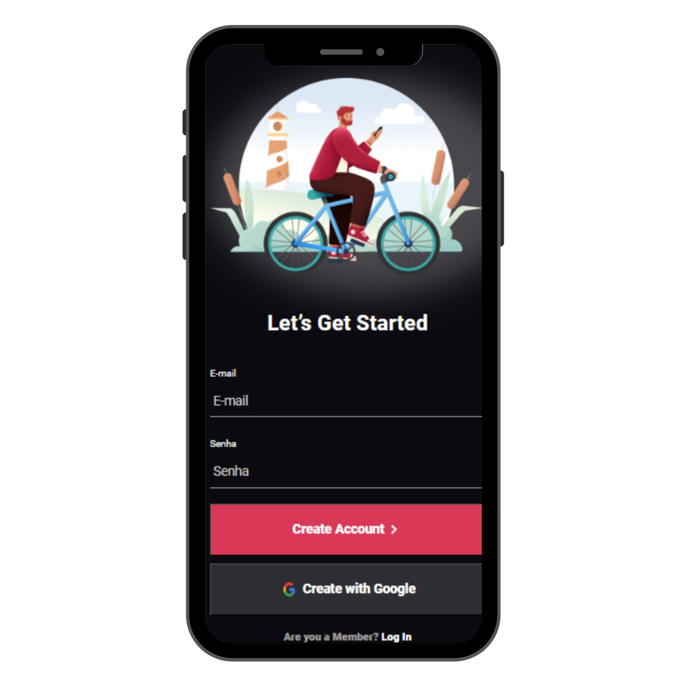

# Tela-de-login

## 📝 Apresentação:
O projeto consiste em uma tela de login com navegação para uma tela de cadastro caso o usuário não possua uma conta e queira criar.

## 🎯 Objetivo:
Trabalhar melhor as raizes do front-end a fim de sempre fixar as bases em meu conhecimento.

## 🔨Feito com:

 

## 🎨 Resultado:
- O resultado pode ser conferido aqui: [**Repl.it**](https://iuriluna.github.io/Tela-de-login/) 
 

----

